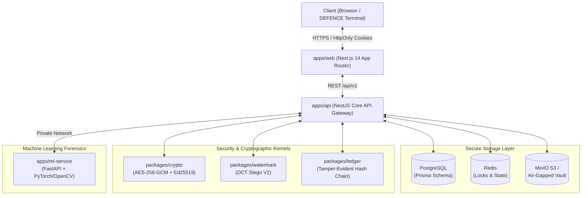
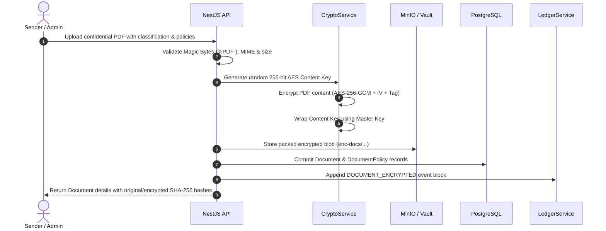
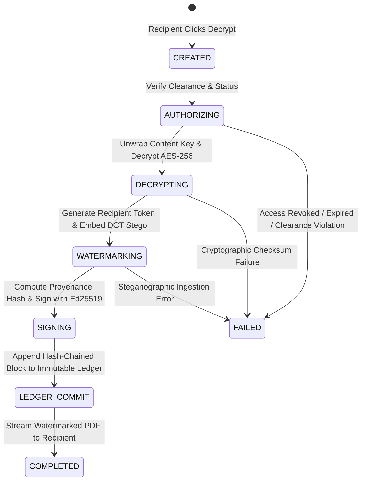
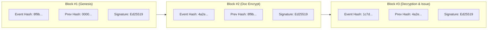
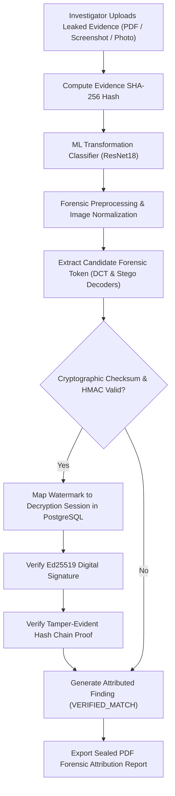

# NETRA SHAKTI // Architecture Blueprint
### Cryptographic Attribution and Immutable Decryption Provenance System

**TRACE THE ORIGIN, PROVE THE TRUTH**

---

## 1. High-Level System Architecture

---

## 2. Ingestion & Document Encryption Workflow

---

## 3. Secure Decryption & Forensic Issuance State Machine

---

## 4. Hash-Chained Immutable Ledger Block Structure

---

## 5. Digital Forensics & Attribution Pipeline

